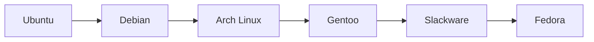

# Welcome!
<ul>
    <li>Creating bugs since 2019</li>
    <li>Linux fan</li>
    <li>Programming enjoyer</li>
</ul>

## Linux distro

## Tools
### Web

    
    
    
    
    
    
    
    
    
    
    
    
    
    
    
    
    
    
    

### Databases

    
    
    
    

### Mobile development

    
    

### General

    
    
    
    
    
    
    
    

### Text editors & IDE

    
    
    

### Browsers

    
    

### For fun :)

    
    
    

